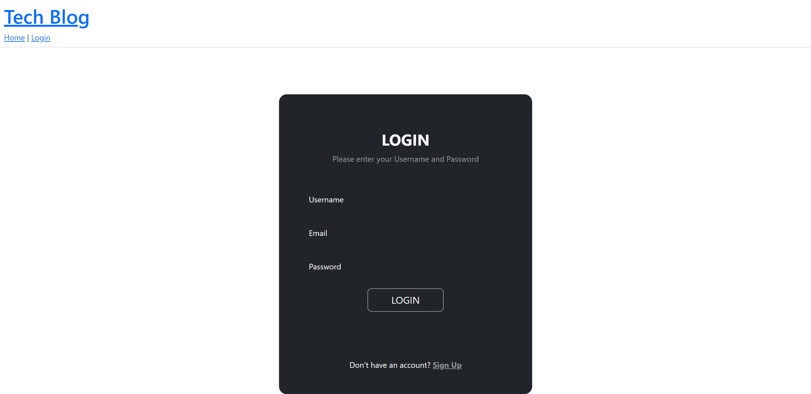

# Tech-blog

## Description

This project is a CMS style Technology Blog site where developers can publish their blog posts and comment on other developer's posts. Built from scratch (referencing project files) and deployed to Heroku. It follows MVC architecture. Uses Handlebars for the front end, mySQL db, sequelize as ORM, and express-session npm package for authentication.

Deployed project: 
https://mighty-retreat-24967-cb1040ca1720.herokuapp.com/

## Installation

* Run schema first
* npm run seed
* node server.js

## Usage

When the page first loads you will be in the home page. The home page shows all posts with their title and date created. After you log in, you are taken to your Dashboard, here you have the option to add a new post. While logged in if you click to go home, you can select a post and it will open a new page where you can view what the post is about, date created, and by whom. Here you will also have the option to comment on the post. Once you add your comment it will appear on the page below the post description. 

Screenshots:

## Credits

Sofia Villalpando

## License

MIT
